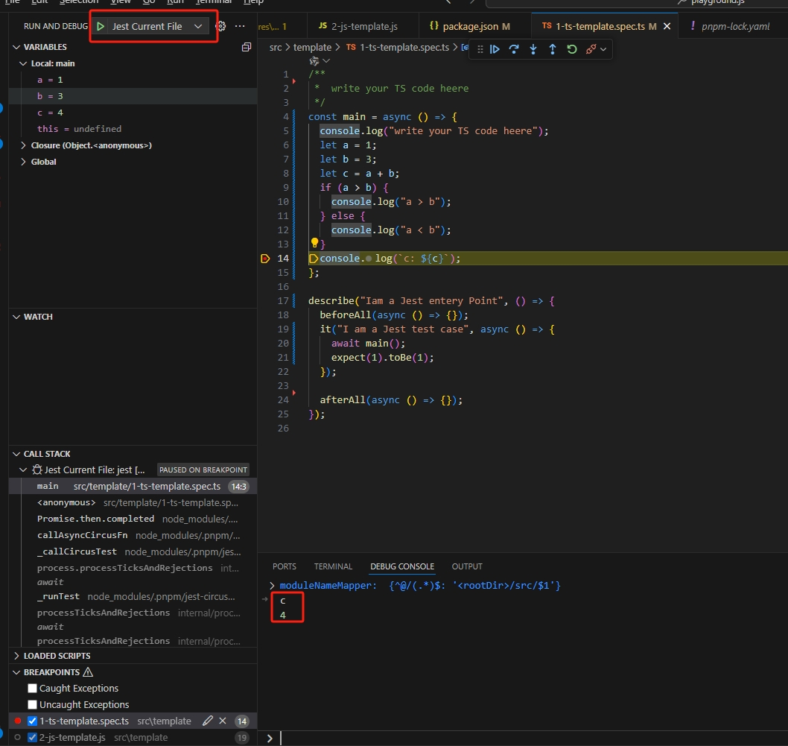
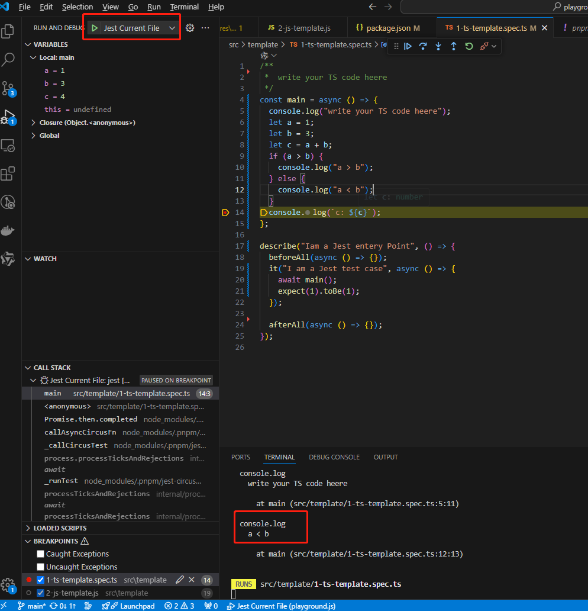
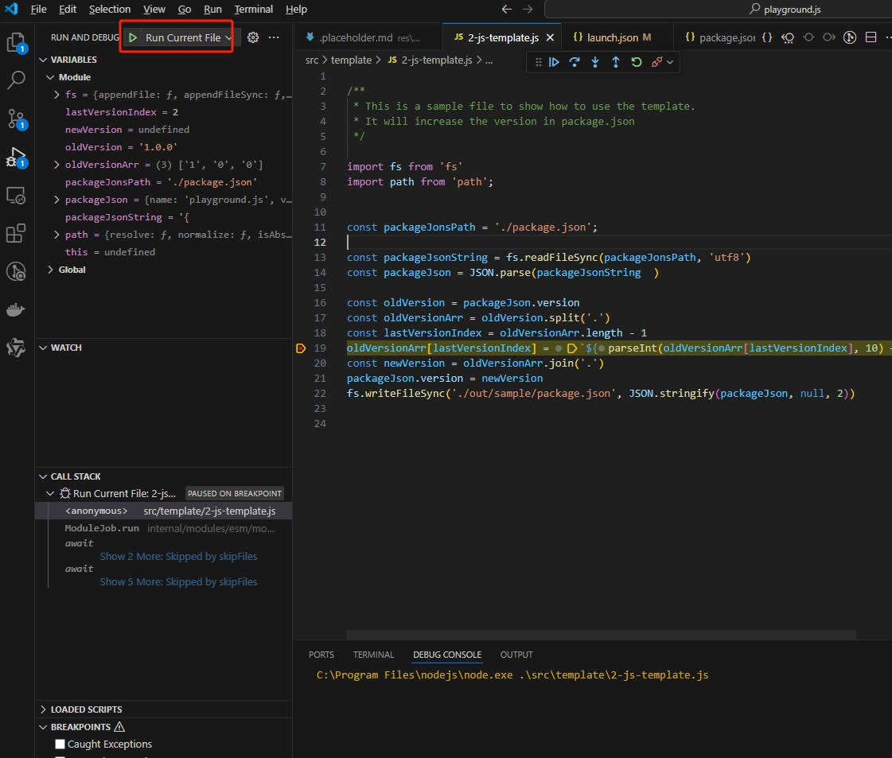

# playground.ts

A playground for js and ts

GitHub address [https://github.com/ygweric/playground.ts](https://github.com/ygweric/playground.ts)

[中文文档](https://github.com/ygweric/playground.ts/blob/main/README-ZH.md) | English Documentation

## What is playground.ts

playground.ts is a playground for js and ts, you can write js/ts script as you want, and run it with vscode, it provides a best practice for you.

## key features

1. run and **debug** for typescript files.
2. run and **debug** for javascript files.
3. manage scripts with folders and git.

## What is playground.ts used for?

I use playground.ts to manage my scripts, including:

- Write spiders(bots) for some websites or endpoints
- Write or test js/ts scripts
- Generate tons of QR Image
- Write and practise leetcode algorithms
- Translalte Chinese website to English with Grammarly and Google Translate
- Analysis the data with AI
- Download tons of images
- etc.

## How can playground.ts debug typescript files?

Generally, we need to run `tsc` to compile typescript files to javascript files, and then run the javascript files.

But playground.ts intergrate **Jest**,you can run or debug a ts file with jest.

## Required environment

- nodejs >= v18.20.1
- **pnpm** is recommended, but **npm/yarn** is also ok.
- open project with **vscode**

### install

```sh
pnpm install
```

## How to use playground.ts

### run/debug ts file

With following steps:
**Select a ts file -> Run and Debug -> Jest Current File**

You can run or debug a ts file with jest. following is the screenshots





<!--  -->

### run js file

You can run js file with node command in terminal.

```sh
node src/template/2-js-template.js
node src/sample/3-base64String-to-png.js
```

### debug js file

With following steps:
**Select a js file -> Run and Debug -> Run Current File**

You can debug a js file. following is the screenshots



## contribute

1. Fork this repo
2. Clone your forked repo
3. Create a new branch
4. Make your changes
5. Commit your changes
6. Push your changes
7. Create a pull request

## License

MIT

## Author

国 wei (Eric)
[Github](https://github.com/ygweric)
